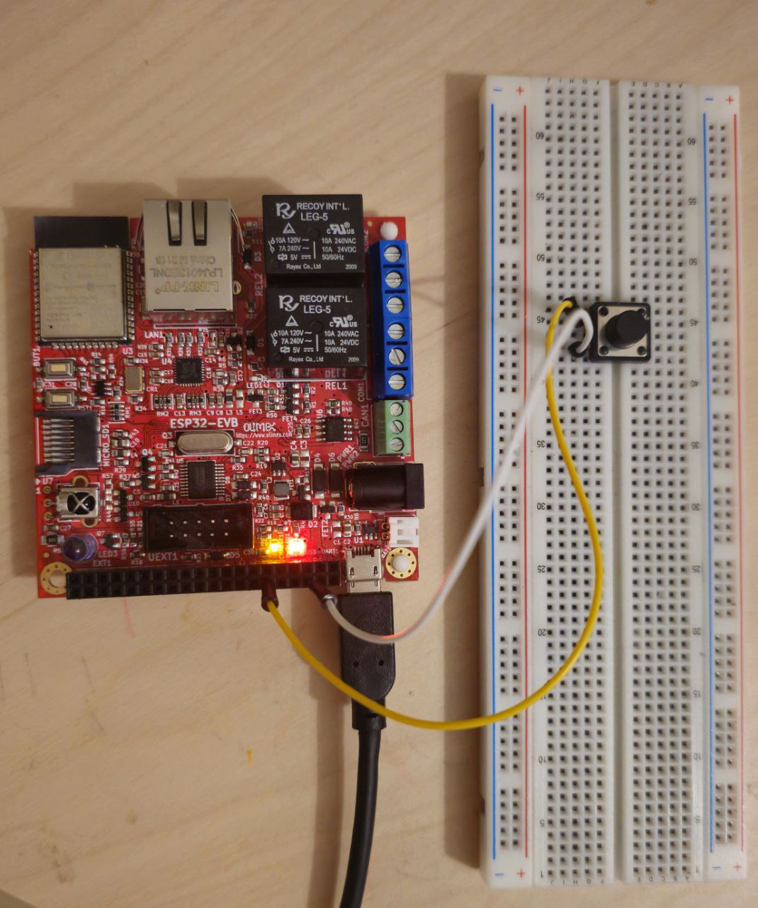

# ESP32 Debounced Button with TDD

This project implements a debounced push button module for the ESP32 using Test-Driven Development (TDD) and hardware timer interrupts. It is built with PlatformIO inside WSL (Windows Subsystem for Linux) and developed in Visual Studio Code.

## Features

- TDD with dual targeting (host and embedded)
- Debounces based on 5 consecutive consistent readings
- Detects stable PRESSED and RELEASED states
- Detects and reports RISING and FALLING edges
- Uses internal pull-up on GPIO 34 (button input)

## Project Structure
## Project Structure

```
project-root/
├── include/
│   └── bsp.h
├── lib/
│   └── Button/
│       ├── button.h
│       └── button.cpp
├── src/
│   └── main.cpp
├── test/
│   ├── test_button.cpp
│   ├── bsp.cpp
│   └── bsp.h
├── platformio.ini
└── make
```


## Tools & Environment
- PlatformIO in WSL (Ubuntu)
- VS Code with WSL integration
- ESP32 Dev Board
- Unity

## Troubleshooting

### Upload Issues on ESP32 (USB Port Busy)

If you encounter issues uploading code to the ESP32, it might be due to another process locking the USB port (e.g., `/dev/ttyUSB0`). You can check and kill the process using the following commands:

List processes using the port:
- lsof /dev/ttyUSB0


Then kill the process (replace `<PID>` with the actual process ID):
kill -9 <PID>
After that, try uploading again:

If you're using a USB-UART chip with different port name (e.g., `/dev/ttyUSB1` or `/dev/ttyACM0`), adjust the path accordingly.

## Build and Test with Make

You can use the provided `make` file for building and testing the project from the command line.

- Run the default build:
  ```
  make
  ```

- Run tests and see output:
  ```
  make check
  ```

- Generate coverage reports using `gcovr` to check how much of `button.cpp` is covered by your tests:
  ```
  gcovr -r . --html --html-details -o coverage.html
  ```

Make sure `gcovr` is installed:
```
pip install gcovr
```




